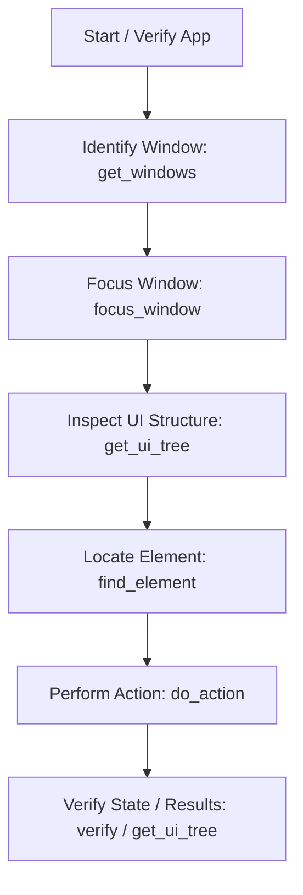

# Windows GUI Automation (gui-automation) Skill Guide

This document is a skill and rule set for Hermes Agent Desktop to invoke the Windows GUI automation plugin (`gui-automation`) and automate desktop applications with high precision and robustness.
When calling the tools, strictly adhere to the procedures and best practices defined in these guidelines.

---

## 1. Basic Operation Flow

As a rule, application operations must be executed step-by-step according to the following process:



---

## 2. API Tool Specifications and Handling Return Values

Understand the role of each tool, its input parameters, and **the structure and interpretation of its return values** to determine your next steps.

### 2.1 `start_application` (Launch Application)
Launches an application from the specified path or command.

* **Primary Arguments**:
  * `cmd_line` (str, Required): The launch command or full path to the executable.
  * `timeout` (float, Default: 5.0): Seconds to wait for the application to launch.
* **Return Value Structure**:
  ```json
  {
    "success": true,
    "action": "start_application",
    "process_id": 12345,
    "process_name": "notepad.exe",
    "elapsed_ms": 500,
    "error": null,
    "error_code": null
  }
  ```
* **Agent Decisions Based on Return Value**:
  * If `success` is `true`, store the `process_id` and proceed to the window identification step.
  * If `success` is `false`, check the `error_code` and `error` message to verify if there is an incorrect path or insufficient permissions (such as requiring administrator privileges).

### 2.2 `get_windows` (Get List of Windows)
Searches for currently open windows.

* **Primary Arguments**:
  * `title_contains` (str, Optional): A substring contained in the window title.
  * `process_name` (str, Optional): The process name (e.g., `"notepad.exe"`).
* **Return Value Structure**:
  ```json
  [
    {
      "title": "Untitled - Notepad",
      "handle": 1055122,
      "process_id": 12345,
      "process_name": "notepad.exe",
      "visible": true,
      "minimized": false
    }
  ]
  ```
* **Agent Decisions Based on Return Value**:
  * The return value is an array. Extract the target window's `handle` (HWND). For subsequent operations (such as `focus_window`, `get_ui_tree`, etc.), specify this `handle` to prevent accidental operations on other windows with similar names or processes.
  * If `minimized` is `true`, the window is currently minimized.

### 2.3 `focus_window` (Focus Window)
Activates the target window and brings it to the foreground. Always perform this before any operations.

* **Primary Arguments**:
  * `window_handle` (int, Recommended) or `window_title` (str).
  * `restore_if_minimized` (bool, Default: `true`): Restores the window if it is minimized.
* **Return Value Structure**:
  ```json
  {
    "success": true,
    "action": "focus_window",
    "elapsed_ms": 150,
    "error": null,
    "error_code": null
  }
  ```
* **Agent Decisions Based on Return Value**:
  * Proceed to UI operations only after confirming that `success` is `true`.
  * If it fails, use `get_windows` to verify if the specified `window_handle` has already been closed.

### 2.4 `get_ui_tree` (Get UI Element Tree)
Retrieves the elements inside a window in a tree structure.

* **Primary Arguments**:
  * `window_handle` (int, Required)
  * `depth` (int, Default: 3): The depth of the hierarchy to retrieve.
* **Return Value Structure**:
  ```json
  {
    "window": { "title": "Untitled - Notepad", "handle": 1055122, "process_id": 12345 },
    "tree": {
      "control_type": "Window",
      "name": "Untitled - Notepad",
      "automation_id": "",
      "handle": 1055122,
      "enabled": true,
      "visible": true,
      "rect": { "x": 100, "y": 50, "width": 800, "height": 600 },
      "value": null,
      "children": [
        {
          "control_type": "Edit",
          "name": "Text Editor",
          "automation_id": "15",
          "handle": 2045612,
          "enabled": true,
          "visible": true,
          "rect": { "x": 100, "y": 70, "width": 800, "height": 580 },
          "value": "Existing text",
          "children": []
        }
      ]
    }
  }
  ```
* **Agent Decisions Based on Return Value**:
  * First, retrieve a shallow tree using `depth=2` or `3` to understand the overall layout.
  * Only increase the `depth` and re-retrieve if the target element is not found within the `children`.
  * Locate the target element's `handle` to use in `do_action`. Use the `value` and `enabled` attributes to evaluate the current state of the elements.

### 2.5 `find_element` (Search for UI Element by Conditions)
Finds and returns the details of elements matching specified search conditions.

* **Primary Arguments**:
  * `window_handle` (int, Required)
  * `conditions` (dict, Required): Specify conditions like `control_type`, `name`, `name_contains`, `automation_id`, etc.
  * `find_all` (bool, Default: `false`): Whether to return a list of all matching elements.
* **Return Value Structure**:
  * When `find_all=false` (Default):
    ```json
    {
      "control_type": "Button",
      "name": "Close",
      "automation_id": "Close",
      "handle": 3045122,
      "enabled": true,
      "visible": true,
      "rect": { "x": 880, "y": 50, "width": 20, "height": 20 },
      "value": null
    }
    ```
  * When `find_all=true`, an array of matching element objects (`list[dict]`) is returned.
* **Agent Decisions Based on Return Value**:
  * Execute `do_action` using the returned element's `handle`.
  * If the element is not found, an error (`ELEMENT_NOT_FOUND`) will be returned. Try relaxing the search conditions (e.g., using `name_contains` instead of `name`), or rescan with a deeper `depth`.

### 2.6 `do_action` (Perform Action on Element)
Performs operations such as click or key input on an element.

* **Primary Arguments**:
  * `handle` (int, Required): The handle of the target UI element.
  * `action` (str, Required): `click`, `type_text`, `select`, `key_press`, `set_value`, etc.
  * `params` (dict, Optional): Action-specific arguments (e.g., `{"text": "Hello", "clear_first": true}`).
  * `verify` (dict, Optional): Post-action verification conditions (e.g., `{"expect": "element_appears", "control_type": "Dialog"}`).
* **Return Value Structure**:
  ```json
  {
    "success": true,
    "action": "click",
    "handle": 3045122,
    "elapsed_ms": 250,
    "error": null,
    "error_code": null,
    "state_after": {
      "control_type": "Button",
      "name": "Close",
      "enabled": true,
      "visible": false
    }
  }
  ```
* **Agent Decisions Based on Return Value**:
  * Always verify that `success` is `true`.
  * If `verify` was specified, the verified state of the element will be included in `state_after`. Confirm that the verification succeeded.
  * If it fails (`success: false`), perform recovery steps using the `error_code` (described below).

### 2.7 `get_installed_applications` (Get Installed Applications)
Retrieves a list of applications installed on Windows.

* **Primary Arguments**:
  * `name_contains` (str, Optional): Case-insensitive partial match filter for application names.
* **Return Value Structure**:
  ```json
  [
    {
      "name": "Google Chrome",
      "version": "120.0.6099.110",
      "publisher": "Google LLC",
      "install_location": "C:\\Program Files\\Google\\Chrome\\Application",
      "uninstall_string": "..."
    }
  ]
  ```
* **Agent Decisions Based on Return Value**:
  * If the target application cannot be launched using its standard executable name, locate its `install_location` using this function. Build the absolute path to the executable file (`.exe`) and pass it to `start_application`.

---

## 3. Best Practices for High-Precision Automation

### 3.1 Controlling Window State
* **Enforce Focusing**: Always call `focus_window` before performing any operations on a window. If a window is hidden in the background, OS-level click and text input events might be blocked.
* **Restore Minimized Windows**: When calling `focus_window`, set `restore_if_minimized: true` to ensure the window is restored and active even if it is minimized.

### 3.2 Gradual Control of Search Depth (`depth`)
* Calling `get_ui_tree` with a deep value like `depth=8` from the start will traverse unnecessary child elements, causing performance to drop significantly.
* **Core Strategy**:
  1. First, call `get_ui_tree` with `depth=2` or `3` to scan the general window header and main content areas.
  2. Once you identify where the target element is nested (e.g., inside lists, tree views, or settings panels), either narrow down the scan by targetting the parent element, or increase the depth to `5` or `6` to rescan.

### 3.3 Locating Elements by Highly Unique Attributes
* Specify `automation_id` in `conditions` for `find_element` whenever possible.
* While the `name` (text label) changes easily depending on language settings or UI state, the `automation_id` is defined as a static identifier during development and provides the most stable lookup.
* Also specify `control_type` to prevent accidental matches with elements of different classes.

### 3.4 Active Utilization of the Verification (`verify`) Feature
* Proactively use the `verify` parameter in `do_action` to verify synchronously at the API level that your action was successfully reflected in the application.
* **Key Verification Patterns**:
  * **When a dialog opens after clicking a button**:
    `verify: {"expect": "element_appears", "control_type": "Dialog", "timeout": 5.0}`
  * **When entering text into an input field**:
    `verify: {"expect": "value_changes", "timeout": 3.0}`
  * **When closing a window using a close button**:
    `verify: {"expect": "window_closes", "timeout": 5.0}`

---

## 4. Error Handling and Automatic Recovery Procedures

If `success` in the API return value is `false`, perform recovery steps based on the returned `error_code`.

| Error Code | Assumed Cause | Agent Recovery Procedure |
| :--- | :--- | :--- |
| **`WINDOW_NOT_FOUND`** | - The application has not launched yet.<br>- The window title changed. | 1. Run `get_windows()` without arguments to check all currently open windows and their titles.<br>2. If a window with a partially matching title exists, use its `handle`.<br>3. If no window exists, relaunch the application using `start_application`. |
| **`ELEMENT_NOT_FOUND`** | - Screen transition has not completed.<br>- Search conditions are too strict.<br>- The element is deeply nested. | 1. Wait for 1–2 seconds and retry `find_element`.<br>2. Rescan the UI structure by calling `get_ui_tree` with an increased `depth`.<br>3. Relax the search conditions, such as switching from exact match `name` to partial match `name_contains`. |
| **`ELEMENT_DISABLED`** | - The input element is read-only.<br>- Prerequisites (like checkboxes) are not met. | 1. Use `get_ui_tree` to inspect the states of surrounding elements.<br>2. Determine if other actions (like clicks) are needed to enable the element, and adjust the execution sequence.<br>3. Try using `set_value` to set the value directly. |
| **`ACCESS_DENIED`** | - Insufficient OS permissions (e.g., operating an admin app).<br>- Blocked by UAC. | 1. Verify if Hermes Agent itself is running with administrator privileges.<br>2. Notify the user: "Administrator privileges are required to run this operation," and abort the task. |
| **`TIMEOUT`** | - Delay in processing.<br>- Verification conditions were not met. | 1. Retrieve the latest UI state using `get_windows` or `get_ui_tree`.<br>2. If the transition has completed, continue processing. Otherwise, increase the timeout duration and retry. |
